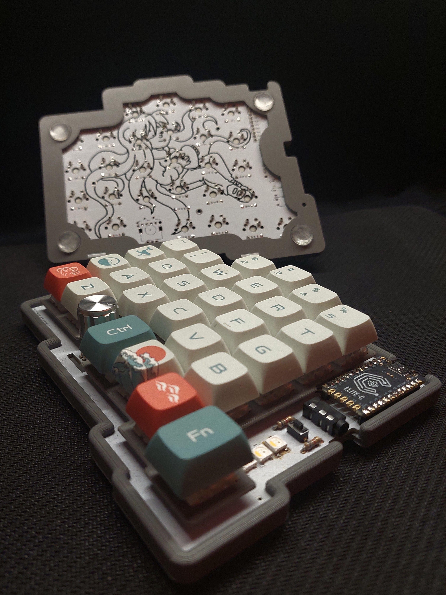
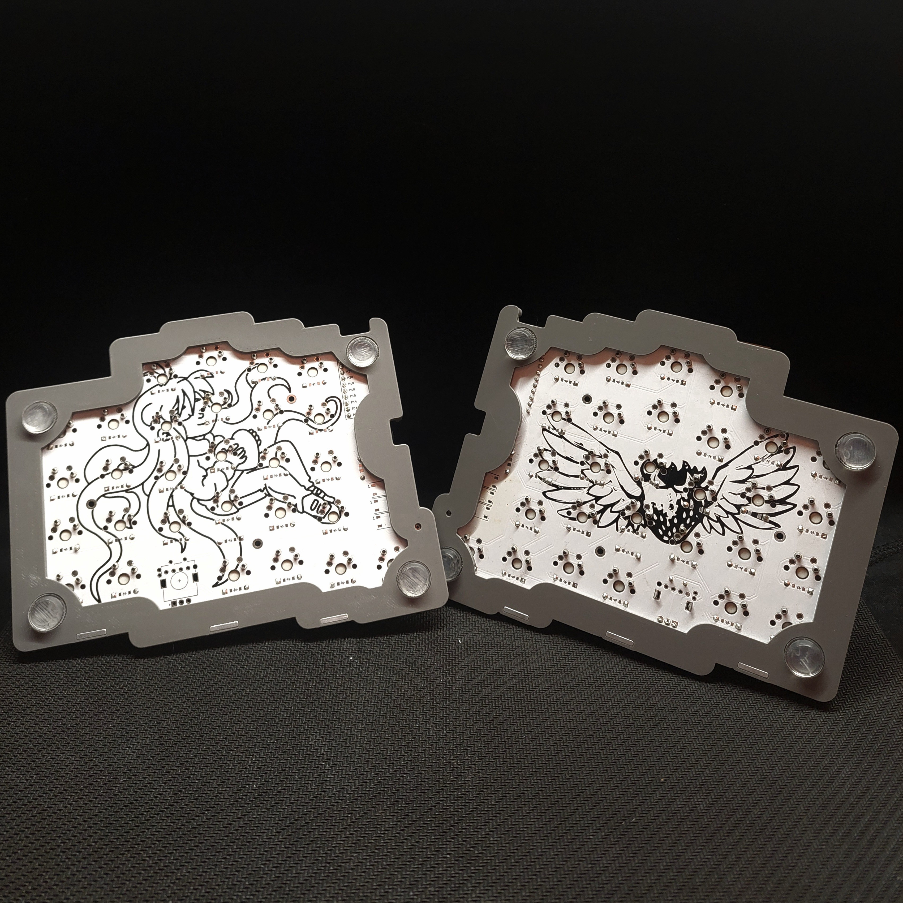

# monkey_typing V1
<p align="center">


</p>

## Setup
Install ergogen cli:
```bash
$ npm i ergogen
```

## Usage
To compile the ergogen config into an (unrouted) KiCad PCB run
```bash
$ cd ergogen/
$ make
```
This will create a KiCad PCB under `ergogen/output/pcbs/monkey-typing_v1.kicad_pcb`.
Then copy this file to another location for routing.
Prerouted versions of the keyboard can be found in `kicad/`.

## Build
### Parts
- [3D-printable case](https://cad.onshape.com/documents/ed0d6a4fe642353b2203faf0/w/5ff3ead430589bfdb49bdc3b/e/f0c0ddc8bc3d8364728c5712)
- [3D-printable switch plate](https://cad.onshape.com/documents/5edfe701ad9f2b4f2a2a6781/w/f609051c12ccf6833f78234f/e/c55f49f04b746962ac1a3068)
- 58 diodes (e.g. 1N48)
- 56 mx-style switches
- mx-style keycaps
- rotary encoder (e.g. KY-040)
- 2 through-hole reset buttons
- 2 TRRS jacks TRRS-PJ-320A
- TRRS cable
- 4 6.8 kOhm resistors
- 6 WS2812B or SK6812 LEDs
- 2 microcontrollers (pro-micro or elite-c)

### Assembly
The RGB diodes are hard to hand solder, so using reflow soldering here is 
recommended.

Add two small drops of solder to the three-way jumpers below the microcontroller
on each side to connect the i2c SDA line/GND from the TRRS jack to the 
microcontroller.

Snapping the PCB into the 3D printed case might require a bit of force.
Solder all components before inserting the PCB into the case,
as removing the PCB again from the case might be difficult.

> [!CAUTION]
> Never plug the TRRS cable in or out while the keyboard is connected via USB!

### Firmware
Flash the [QMK firmware](https://github.com/arrowtip/monkey-typing_qmk) to the microcontrollers on both sides.

